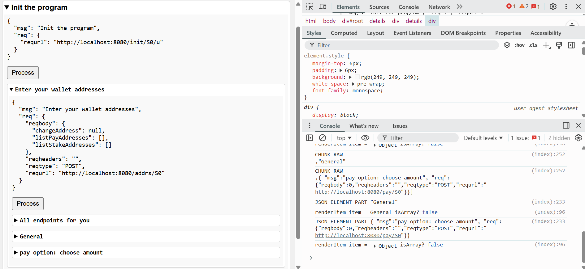

# Cardano Cloud: Persistent Runtime Foundation for Off-Chain DSLs

A serverless Haskell Library that turns smart-contract specs into reusable library calls that run verifiable, restart-proof flows. It includes all the necesary for the execution.

see docs for description, activity and notes

## Status
- Core runtime: Working. It essentially the Transient stack with additions for persistence
    - like persistent collect https://x.com/AGoCorona/status/1993762316358209733?s=20
    - The transient stack: https://github.dev/transient-haskell/transient-stack
- Most of the work carried out now is devoted to develop and tune the persistence primitives
    - To preserve non serializable state across shutdowns and restarts. Done
    - To manage state when many requests are summarized in a single response such is the case in collect and algebraic operations with various terms. Done
    - Specially when the state includes non serializable things like backtracking handlers.Done
    - Direct integration with cardano-api to implement high level primitives. Going on
        - generalized transactions with multiple wallets assets, contracts, selection of utxos, balancing, multisign in browsers,  - ongoing
        - Cache for fast queries - ongoing
    - Testting recovery with arbitrary shutdowns. mostly done
    - A general web application (Web console) in vanilla Javascript and HTML. loads when the cardano cloud node is invoked. Allows for full interaction with any cardano-cloud program. Permits the execution of the contract. This contains all the code for wallet connection, signing transactions and examination of the requests and responses. It contains example code to grab for custom web interfaces. Done

    

    - All the previous points can be improved for robustness, performance and modularity.
    - further improvements: 
      - Patterns -> primitives for transacitions with n signers, 
      - utxo selection
      - identify backtracking conditions for autohealing in complex situations. 
      - Pattern discovery for the creation of more composable and higher level primitives.
      - Caching: a graph database, using the haskell package TCache synchronized with the Cardano node for fast querying wallet accounts, utxos etc. 
      - Tests with IPFS persistence
      - Distributed computing for scalability and reliability. To create a L2 services over Cardano.
      - ...
      - Tons of things to do.

imagine thounsands of requests being gathered by this code:

```haskell
 ...
 allInvestments <- collect anyNumber forOneMonth $ do
        investment <- minput "/invest" InvestmentPayload
        return investment `onBack` \FailedFunding -> do
            wallet <- getInvestorWallet investment
            fees   <- estimateFees
            refund wallet (investmentAmount investment - fees)
 ...
```
This code should get HTTP requests from investors for a month even if the program should restart.
after a month it should summarize all the information gathered of each investor amount and what to do 
if the financing is not successful and that info should survive restarts

for each request, and there may be thounsands of them, the failed funding handler should:

- respond to the FailedFunding event even if the programs was restarted in the middle
- get fees that was set *at the end* of the contract 
- refund the investor even if the server has been shut down in the middle


## Catalyst proposal

https://app.projectcatalyst.io/proposal/019a8454-c3c7-768a-89c6-d6a7a9c6b371

## Example: Auction
```haskell
defiAuction = do
  lockTx <- liftCTL $ lock 10_000_000 "initial"
  bids <- collect 100 3600000000 $ minput "/bid" minPayload
  winner <- selectWinner bids
  liftCTL $ pay winner (amount winner * 1_000_000)


