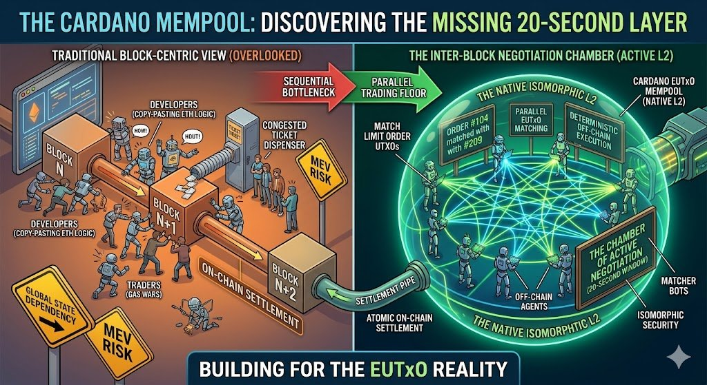
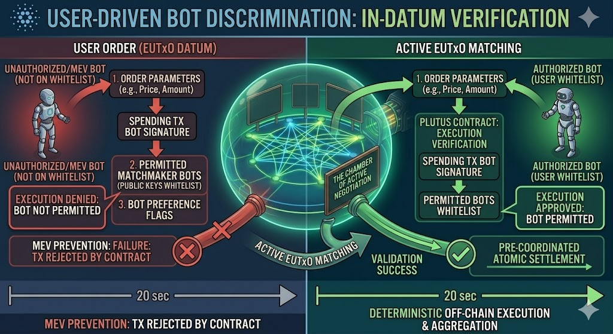

# Beyond Speed: Why the Mempool Trading Floor Serves Every Market

## The Mempool as a Trading Floor

Between every two Cardano blocks there is a window of approximately 20 seconds. Most DeFi developers ignore it entirely, replicating Ethereum patterns and waiting for block confirmation. But that window is not dead time — it is a live trading floor where orders are visible, UTxOs are deterministic, and matches can be constructed and confirmed to users before the block even arrives.

The core idea: a matcher bot observes compatible orders in the mempool, constructs the matching transaction, submits it, and notifies both users — all before the block lands. When settlement happens, the trade is already done. No Layer 2. No bridge. No TVL capture. The mempool is the execution layer; the blockchain is the settlement layer.

This idea is developed in detail in [The End of DeFi Theater](https://x.com/AGoCorona/status/2044377954206068881) and [A Tale of Two Trading Floors](https://github.com/agocorona/cardano-cloud/blob/main/docs/A%20Tale%20of%20Two%20Trading%20Floors.md). The present article addresses a specific objection — and a deeper architectural principle that emerges from it.

## The Settlement Layer Should Not Pick Sides

Any policy that governs which transactions a block producer accepts or rejects is, implicitly, a statement about what kind of market Cardano is. That is a choice that should not be made at the protocol level.

Consider a concrete example: introducing **fee priority** — highest fee wins — to reduce contention when multiple bots attempt to match the same order. It is a coherent engineering response to a real problem. But it carries an architectural consequence that extends far beyond contention: it turns the 20-second block window into an **auction room**, where the rational strategy for every matcher is to wait until the last possible moment before submitting. Why commit early when a competitor might outbid you at second 19? The result is maximum latency by design, fee wars in the final seconds of every block.
 
There is also a concrete engineering cost: any ordering policy that compares competing transactions against each other requires maintaining a priority queue, potentially evicting already-accepted transactions when higher-ranked alternatives arrive, and deferring block assembly until the window closes. Validation is no longer O(1) per transaction. Block filling can no longer happen gradually as transactions arrive. These are not neutral tradeoffs — they have measurable impact on latency and computation.

Fee priority is one example, but the same structural problem appears in any selection policy that embeds a market preference: prioritizing matched orders over unmatched ones, favoring low-slippage transactions, rewarding provably optimal executions. Each policy, however well-intentioned, presupposes a particular vision of what DeFi on Cardano should look like — and imposes that vision on every participant.

The settlement layer should be as fast and simple as possible. That is how it works today. **Complexity belongs elsewhere.**

## Where Complexity Belongs

A common reaction to the mempool-as-trading-floor idea is: "isn't this just optimizing for speed?" It's a fair question. But it misses the point entirely.

This is not a proposal to build a Hyperliquid on Cardano. It is a proposal for a **general DeFi architecture** that serves every type of participant — from the scalper who operates with 5x leverage to the institutional trader who wants optimal price discovery over a negotiation window. Speed is one dimension. Not the only one.

The protocol should not presuppose which type of market it serves. It should not prioritize any particular strategy. That decision belongs to the user — expressed not in the protocol rules of Cardano, but in the smart contract and datum of each individual order.

## The Order Contract and Its Datum

Before going further, a clarification: we are not talking about smart contracts in general. We are talking specifically about the **smart contract that accompanies a user's order** — the script locked to the UTxO that represents a swap request, a bid, or any other DeFi position.

When a user places an order, they lock assets into a UTxO. That UTxO carries a **datum** — a structured, publicly visible piece of data that describes the order: the offered asset, the requested asset, the price, the expiration, and any additional conditions. The datum is the on-chain representation of the user's intent. It is what matcher bots read to find compatible counterparties, and it is what the smart contract uses to verify that the transaction consuming the UTxO is legitimate.

The datum and the contract are two sides of the same declaration: the datum states the terms visibly, the contract enforces them mechanically. If the datum says "minimum price 10 ADA per DJED", the contract rejects any transaction that pays less. If it says "expires at slot 1000000", the contract rejects any transaction submitted after that point.

But here is the fundamental limit: **the datum can only express conditions that are verifiable at the moment of settlement**. It can state a price floor. It can state a time window. What it cannot express is *how* the matching process should have unfolded during that window — because by the time the contract executes, that process is already history. The datum captures the measurable result; it cannot capture the intent behind the process.

## The Limits of Smart Contract Verification

Here is the subtle but crucial problem. A user places an order by locking a UTxO with a datum that expresses their preferences:

- A minimum negotiation window of 15 seconds
- A fee ceiling of 0.5 ADA
- A preference for best-price matching over first-available matching

The smart contract attached to that UTxO is **stateless and executes exactly once** — at the moment the block producer validates the transaction that consumes it. By that point, the matching transaction has already been constructed and submitted. The contract can verify that the output amounts are correct, that the price satisfies the limit, that the fee is within bounds. What it **cannot** verify is *how* the matcher arrived at that match.

A bot can read the datum, observe the 15-second negotiation window, wait the required time — and then immediately match with the very first counterparty that appears, ignoring all others. The contract sees a valid transaction. The user's preference for optimal price discovery was never honored. There is no on-chain way to prove the violation.

This is not a flaw in Cardano. It is a fundamental limit of stateless verification: the contract can check the result, but not the process.

## The Secretary Problem and Why It Matters

The philosophy behind a negotiation window is not arbitrary. It is rooted in a well-studied concept in decision theory: the **Optimal Stopping Problem**, sometimes called the Secretary Problem.

The idea is simple: if you have N candidates arriving sequentially and you must decide on each one immediately, the optimal strategy is to observe the first 37% of candidates without accepting any, then accept the next one that is better than all previous ones. Applied to order matching: observe offers during the negotiation window, build a statistical baseline, then select the next offer that improves on what was seen.

A matcher that honors this strategy will, on average, produce significantly better execution prices than one that matches the first available counterparty. The difference is not marginal — it is the difference between a naive bot and a genuinely intelligent one.

But the smart contract cannot distinguish between the two. It only sees the final match.

## Bot Reputation as a Market Mechanism

The solution is not to make the protocol more complex. It is to let the **market select for honest bots**.

A user's datum can express not just preferences about price and timing, but about *which bots are allowed to handle the order*:

- A whitelist of approved matcher bot identities
- A blacklist of bots known to ignore negotiation preferences
- A requirement that the matcher's source code hash matches a known audited version

A matcher bot whose source code is open, audited, and demonstrably implements the negotiation strategy the user requested gains a structural advantage. Users who care about execution quality will route their orders to that bot. Users who only care about speed will use a faster, simpler bot. The market self-segments by preference without any central authority deciding the rules.

Speed stops being the only winning factor. **Trust, transparency, and verifiable behavior become first-class competitive dimensions.**

There is a further practical benefit: **bot discrimination reduces contention**. In the current model, multiple bots may simultaneously attempt to match the same order, each constructing a competing transaction. All but one will be rejected at settlement, wasting computation, fees, and network bandwidth. When an order's datum explicitly whitelists certain bots, the excluded bots know in advance they will be rejected — so they do not attempt the match at all. Contention drops, the network is less congested, and the winning bot's transaction reaches settlement without competing noise. The whitelist is not just a user preference mechanism — it is a coordination signal that makes the whole system more efficient.

This is not regulation imposed from outside. It is reputation emerging from the market — enforced not by a governance committee but by users exercising choice at the datum level.

But the implications go further than contention reduction and reputation. **Bot selection unlocks arbitrarily complex strategies that no smart contract could ever verify** — because the strategy unfolds over time, not at a single settlement point.

Consider a long-term auction that lasts for days. The order's datum encodes the parameters: duration, minimum price increments, reserve price, expiration. The smart contract is deliberately simple — it only verifies that the transaction was constructed by the whitelisted bot and that the final price meets the floor. Everything else — the accumulation of bids, the management of competing offers over days, the optimal stopping logic — is the bot's responsibility, auditable in its source code but invisible to the contract.

This is a clean separation of concerns: the smart contract enforces the outcome conditions, the bot implements the strategy, and the user selects the bot whose strategy they trust. A user who wants a 72-hour English auction selects a bot known to implement that logic. A user who wants a Dutch auction selects a different one. A user who wants a sealed-bid mechanism selects another. The protocol supports all of them without any changes — because the protocol only sees a UTxO, a datum, and a final transaction that satisfies the contract.

The mempool trading floor is not just a faster settlement layer. It is a **general execution environment** where the sophistication of the market is bounded only by the strategies that bots implement and users choose to trust.

## Why This Is Only Possible on Cardano

This mechanism requires that the order — including the bot preference — survives intact until settlement and is verifiable at that point. In Ethereum's account model, the transaction is constructed and submitted by the bot itself, and there is no equivalent of a user-controlled datum that the validator checks against the matcher identity.

In Cardano's eUTXO model, the user's UTxO carries the datum. The smart contract runs at settlement and can verify the matcher's identity against the user's stated preferences. The user's intent is preserved on-chain from the moment the order is placed until the moment it is filled.

## A DeFi Architecture for Everyone

The result is an architecture that does not optimize for one use case:

**High-frequency traders** get atomic matching the moment a counterparty appears — no waiting, no batching, minimal fee.

**Price-sensitive traders** get a negotiation window with intelligent matching strategies — optimal stopping, batch price discovery, best execution.

**Institutional participants** get auditable bots with verifiable behavior — the equivalent of a prime brokerage relationship, but trustless and on-chain.

**Market makers** compete on spread, speed, and reputation simultaneously — not just on who can front-run the fastest.

The protocol is neutral. The smart contract is the policy. The datum is the user's voice. And the market rewards the bots that listen.

This is what a general DeFi infrastructure looks like. Not a faster version of what already exists — a fundamentally different model where the user is in control at every layer.

---

*This architecture is being implemented in [Cardano Cloud](https://github.com/agocorona/cardano-cloud), a declarative runtime for off-chain smart contract logic, built on top of [DeFi Kernel](https://github.com/fallen-icarus/cardano-swaps) by @fallen_icarus.*