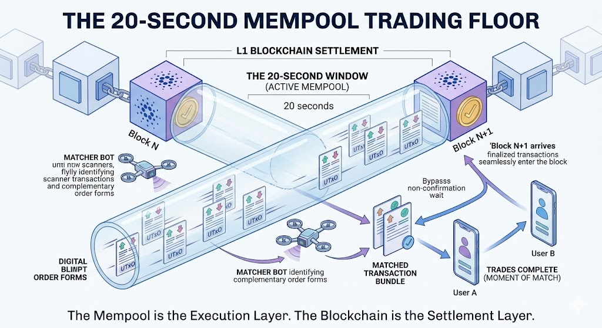
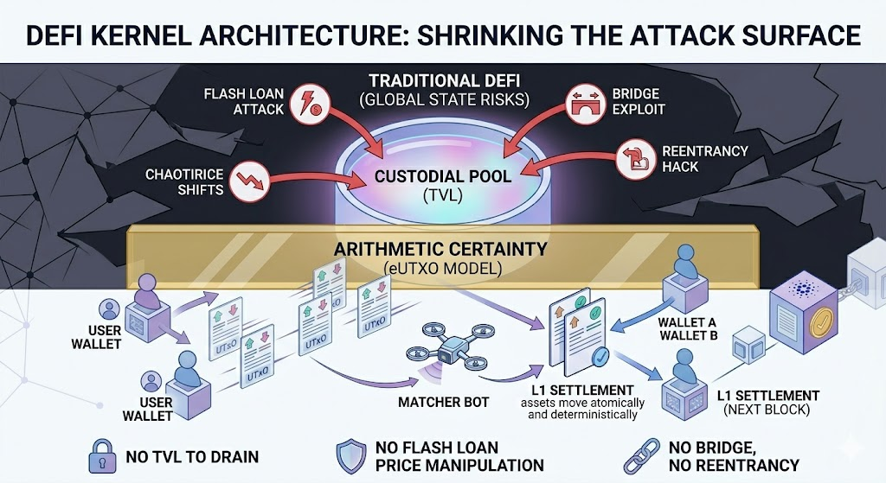
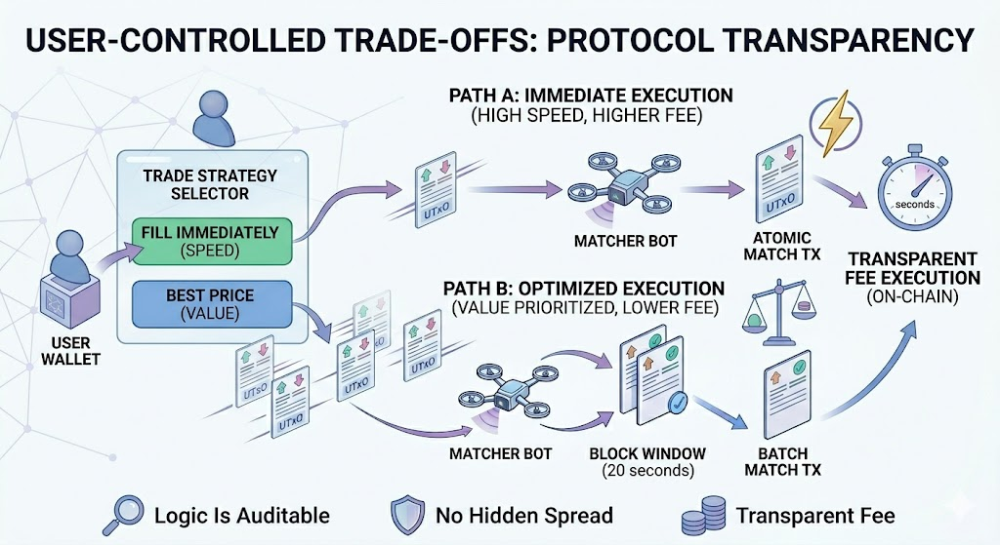
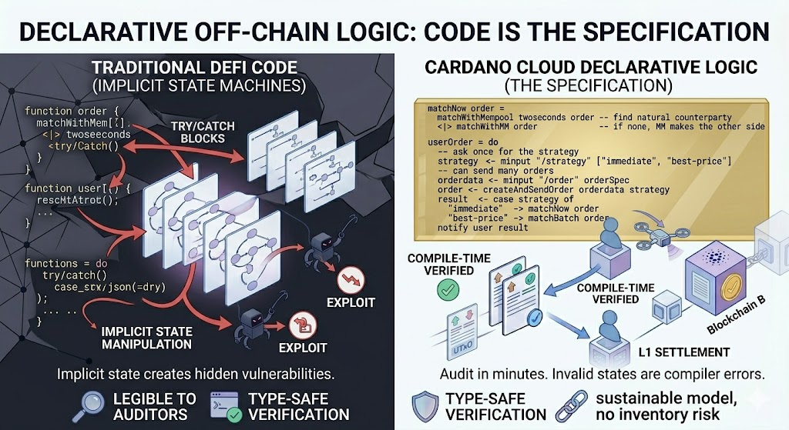

# The End of DeFi Theater: How Cardano's Mempool Changes Everything

Most DeFi is theater. Fake liquidity. Wash trading. TVL that's borrowed, looped, or inflated. "Decentralized" exchanges that hold your funds until they decide to settle. High-profile exploits that aren't on-chain bugs — they're off-chain coordination failures dressed up as smart contract risk.

There's a better architecture. And it's been hiding in plain sight inside Cardano's mempool.

## The underused 20-Second Window

Between every two Cardano blocks there's a window of approximately 20 seconds. During that window, the mempool is a live trading floor: orders are visible, UTxOs are deterministic, and matches are possible before any block is confirmed.

A matcher bot can observe two compatible orders in the mempool, construct the matching transaction, submit it, and notify both users — all before the block arrives. When the block lands, the trade is already done. The user didn't wait for confirmation. They received it the moment the match was constructed.



This is not a Layer 2. There is no bridge. There is no TVL to capture. Settlement happens natively on L1 in the next block. The mempool is the execution layer. The blockchain is the settlement layer. No extra infrastructure required.

*Full argument: [Endgame of Decentralized Finance](https://github.com/agocorona/cardano-cloud/blob/main/docs/Endgame%20of%20decentralized%20finance.md)*

## Why This Only Works on Cardano

In Ethereum, the mempool is a battlefield. MEV bots front-run your orders. Validators reorder transactions for profit. Your trade lands somewhere you didn't expect, at a price you didn't agree to. The mempool is adversarial by design because Ethereum's account model creates global state that can be raced.

Cardano's eUTXO model is structurally different. Transactions are independent. There is no global state to race. Two matchers cannot consume the same UTxO simultaneously — one wins, the other fails cleanly and retries. Front-running is not merely discouraged, it is meaningless: you cannot spend someone else's UTxO before they do.

The regionalization of the mempool — the fact that different nodes see transactions at slightly different times — is not a weakness here. It means multiple matchers operating at different points in the network topology see different subsets of orders at different moments. They compete independently, without coordination, and without conflict. The market becomes more resilient the more matchers participate.

*Deep dive: [A Tale of Two Trading Floors](https://github.com/agocorona/cardano-cloud/blob/main/docs/A%20Tale%20of%20Two%20Trading%20Floors.md)*

## The End of Fraudulent Practices — By Math, Not by Rules

Wash trading requires moving assets in circles at near-zero cost to simulate volume. Here, every match is a real L1 transaction with real fees. Simulating volume costs real money every time. It's not a policy that can be gamed — it's arithmetic.

Fake liquidity requires deposited TVL to inflate. There is no TVL. Every order lives in the user's own wallet until the exact moment of settlement. There is nothing to inflate. 

There is no value locked in the first place. All the liquidity is shared and open for everyone who want to participate: traders, matcher bots, trading web interfaces, market makers...

Flash loan manipulation requires an AMM pool whose price can be moved and returned within a single transaction. There is no pool. Orders are UTxOs with fixed prices set by their owners. A flash loan cannot change the price of a limit order.



Front-running requires reordering transactions in a block. In eUTXO, transaction ordering within a block is irrelevant — each transaction consumes specific UTxOs that no other transaction can touch. The First-Seen rule in Cardano's mempool handles conflicts before they reach the block.

The attack surface shrinks to near zero. There is no custodial smart contract holding user funds — nothing to drain. There is no bridge — no bridge exploit possible. There is no global mutable state — no reentrancy. Assets leave the user's wallet exactly once: at settlement, on L1, in the next block.

## User-Controlled Trade-Offs

Not every user wants the same thing. The protocol makes the trade-off explicit and puts the user in control.

**Fill immediately**: the matcher constructs an atomic match the moment two compatible orders appear in the mempool. Higher fee, confirmation in seconds. For users who need speed above all — futures positions, time-sensitive arbitrage, high-frequency spot trading.



**Best price**: the matcher waits for the block window, accumulates orders, and constructs a batch transaction that finds the optimal price across multiple buyers and sellers. Lower fee, slightly more latency, better execution price. For users who prioritize value over speed.

The fee is transparent. The logic is auditable. The user chooses. No hidden spread, no opaque routing, no algorithmic dark pool deciding your fate.

## Market Making and Its Natural Evolution

What happens when there is no natural counterparty for an order? This is where Market Makers enter.

A MM posts two-way swap UTxOs — orders that can be taken in either direction at prices that include a spread. When a user's order has no natural match in the mempool, the MM makes the other side of the trade, capturing the spread as the price of providing immediate liquidity.

Initially the protocol operator can act as the primary MM, bootstrapping liquidity and capturing the spread while volume is low. As trading volume grows, other MMs enter because the spread is profitable and the risk is predictable — the mempool gives them full visibility into order flow before committing capital. Competition between MMs compresses the spread. Users get better prices. The most efficient MMs survive.

No permission is required to become a MM. No deposit into a protocol contract. No governance vote. Just capital, a node, and a matching algorithm. The barrier to entry is technical excellence, not capital capture.

This is how healthy markets form. And it can evolve further: as the protocol matures, the operator can transition from earning spread to earning fees for matching infrastructure — a more sustainable model with less inventory risk, while MMs compete freely on price.

## The Code Is the Specification

The concept is inherently open for all the Cardano community. The [DeFi Kernel](https://github.com/fallen-icarus/cardano-swaps) by @fallen_icarus  has the base order definitions, the contracts and matching logic to start working. My implementation will be based on [Cardano Cloud](https://github.com/agocorona/cardano-cloud). It is a declarative runtime for  off-chain smart contract logic that can become both as the first open implementation that may be a reference.

The entire off-chain matching logic can be summarized in this code:

```haskell
matchNow order =
  matchWithMempool twoseconds order  -- find natural counterparty
  <|> matchWithMM order              -- if none, MM makes the other side

userOrder = do
  -- ask once for the strategy
  strategy  <- minput "/strategy" ["immediate", "best-price"]
  -- can send many orders
  orderdata <- minput "/order" orderSpec
  order <- createAndSendOrder orderdata strategy
  match order

match order= do
  result   <- case strategy of
    "immediate"  -> matchNow order
    "best-price" -> matchBatch order
  notify user result

matchWithMempool time order= timeout time $ do
  tx <- mempoolSpitter -- < stream of mempool transactions
  guard (isDefiKernelProtocol tx)
  if tx `matchWith` order
    then do endSpitter; sendTx $ createAndSendMatchingTx tx order
    else match tx

    
```
Note that match is used for the internal as well as for the external orders read from the mempool. This is a tentative program of course but it is not pseudocode. It is cardano-cloud code that may be compiled.


An auditor reads this in minutes and understands the complete contract of behavior: what the user provides, what options they have, what guarantees each path offers. The program verifies state transitions at compile time using simplifiled Haskell. Invalid states are compiler errors, not runtime exploits discovered after millions in losses.

## Not a Product. Infrastructure.

Hyperliquid proved there is massive demand for fast, low-fee trading with immediate confirmation. But Hyperliquid is a CEX with a governance token. One team controls the orderbook. One point of failure. One point of capture.

This offers the same perceived speed. Real L1 settlement. No single point of control. An open protocol where anyone can run a matcher, anyone can provide liquidity, anyone can build a UI. Competition happens at the service layer — responsiveness, fee structure, UX, network topology — not at the liquidity capture layer. Infrastructure-independent execution of cardano-cloud programs.

With Leios on the horizon, Cardano's throughput increases dramatically. The same architecture scales linearly. More matchers, more order flow, same guarantees.

The mempool window has been open since Cardano launched. The eUTXO model makes it safe. The open swap standard makes it composable. The declarative runtime makes it auditable.

The infrastructure is ready. The window is open.
