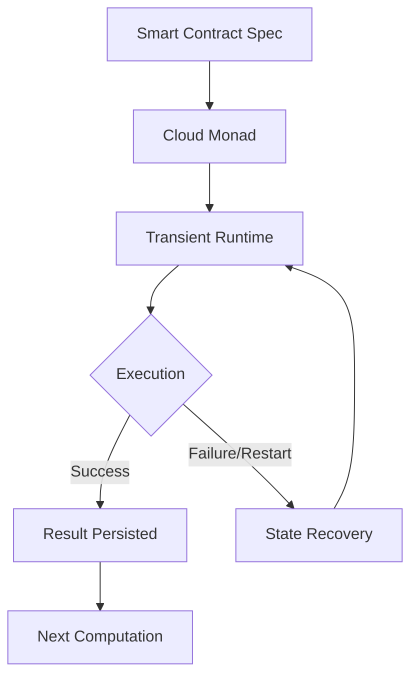
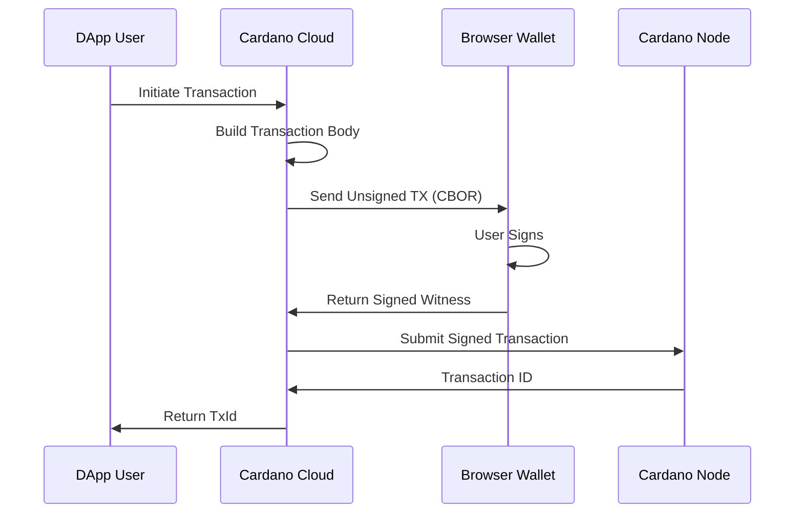

# Cardano Cloud: Architecture Overview

## Project Summary

**Cardano Cloud** is a infrastructure-independent Haskell library that transforms smart contract specifications into reusable library calls that execute verifiable, restart-proof flows. It provides a persistent runtime foundation for off-chain DSLs (Domain Specific Languages) on the Cardano blockchain.

### Core Value Proposition
- **Durable computations**: Smart contracts survive server restarts and failures
- **Backtracking preservation**: Transaction handlers are honored even after shutdowns
- **Infrastructure-independent execution**: Turns smart contract specs into reusable library calls
- **Verifiable flows**: All operations are transparent and auditable

## Architecture Components

### 1. Core Runtime Layer (Transient Stack)
```
┌─────────────────────────────────────────────────┐
│            Cardano Cloud Runtime                │
├─────────────────────────────────────────────────┤
│  Transient Stack (Concurrent/Distributed Runtime)│
│  • TransIO Monad (Extensible Effects)           │
│  • Backtracking & Exception Handling            │
│  • Distributed Computing Primitives             │
│  • Persistent State Management                  │
└─────────────────────────────────────────────────┘
```

### 2. Cardano Integration Layer
```
┌─────────────────────────────────────────────────┐
│           CardanoC.Api Module                  │
├─────────────────────────────────────────────────┤
│  CloudEnv Management                           │
│  • LocalNodeConnectInfo                        │
│  • SigningKey & Address Management             │
│  • Protocol Parameters                         │
│                                                │
│  Transaction Primitives                        │
│  • lock() - Lock funds in scripts              │
│  • pay() - Send ADA to addresses               │
│  • buildAndSubmitTx() - Transaction building   │
│  • signTxBrowser() - Browser-based signing     │
│                                                │
│  Chain Interaction                            │
│  • currentSlot() - Get current slot            │
│  • waitUntil() - Wait for specific slot       │
│  • getUTxOsAt() - Query UTxOs                  │
│  • submitSignedTx() - Submit transactions      │
└─────────────────────────────────────────────────┘
```

### 3. Store-and-Forward Layer (CardanoC.SF)
```
┌─────────────────────────────────────────────────┐
│           CardanoC.SF Module                   │
├─────────────────────────────────────────────────┤
│  Persistent Collect Primitives                 │
│  • collect() - Gather results over time        │
│  • runC() - Cloud computation runner           │
│  • job() - Persistent job execution            │
│                                                │
│  Backtracking Preservation                     │
│  • Handler persistence across restarts         │
│  • State recovery mechanisms                   │
│  • Transaction undo/redo support               │
└─────────────────────────────────────────────────┘
```

## Key Architectural Patterns

### 1. Persistent Computation Model


### 2. Backtracking Preservation System
```
┌─────────────────────────────────────────────────┐
│           Original Execution                    │
│  collect(100, 3600000000) {                     │
│    investment <- minput "/invest" Investment    │
│    return investment `onBack` FailedFunding ->  │
│      wallet <- getInvestorWallet investment     │
│      fees <- estimateFees                       │
│      refund wallet (investment - fees)          │
│  }                                              │
└─────────────────────────────────────────────────┘
         │
         ▼ (Program Restart)
┌─────────────────────────────────────────────────┐
│           Restored Execution                    │
│  • Investment data recovered from persistence   │
│  • FailedFunding handler still registered       │
│  • Can trigger refund even after restart        │
└─────────────────────────────────────────────────┘
```

### 3. Transaction Flow


## Technical Stack

### Dependencies
- **Haskell** (Primary language)
- **cardano-api** (Cardano blockchain interaction)
- **transient** (Concurrent/distributed runtime)
- **transient-universe** (Distributed computing extensions)
- **containers, mtl, text** (Standard Haskell libraries)

### Project Structure
```
cardano-cloud/
├── src/CardanoC/
│   ├── Api.hs           # Cardano API integration
│   └── SF.hs            # Store-and-forward primitives
├── tests/
│   ├── test.hs          # Example usage
│   └── payment.*        # Test keys and addresses
├── docs/
│   ├── notes.md         # Design documentation
│   └── Prop.md          # Formal properties
└── cardano-cloud.cabal  # Build configuration

transient-stack/
├── transient/           # Core runtime
├── transient-universe/  # Distributed computing
└── ...                 # Additional transient libraries
```

## Key Innovations

### 1. Algebraic Concurrency Model
- Uses Haskell's type classes (`Num`, `Semigroup`) for parallel composition
- Binary operators (`+`, `*`, `<>`) execute computations in parallel
- Enables declarative parallel programming patterns

### 2. Persistent Backtracking
- Exception handlers survive process restarts
- Transaction undo/redo preserved across shutdowns
- State recovery for long-running computations

### 3. Browser Integration
- `signTxBrowser()` enables browser wallet integration
- Web-based transaction signing flows
- REST API endpoints for DApp interaction

### 4. Infrastructure-independent Smart Contracts
- Smart contracts as reusable library functions
- No server management required
- Automatic scaling through transient runtime

## Use Cases

### 1. Crowdfunding with Automatic Refunds
```haskell
crowdFunding desiredAmount duration = do
  investments <- collectp 0 duration $ do
    investment <- minput "/invest" InvestmentPayload
    return investment `onBack` FailedFunding -> do
      wallet <- getInvestorWallet investment
      fees <- estimateFees
      refund wallet (investmentAmount investment - fees)
  
  let totalRaised = sum (map investmentAmount investments)
  when (totalRaised < desiredAmount) $ back FailedFunding
```

### 2. Decentralized Auctions
```haskell
defiAuction = do
  lockTx <- liftCTL $ lock 10_000_000 "initial"
  bids <- collect 100 3600000000 $ minput "/bid" minPayload
  winner <- selectWinner bids
  liftCTL $ pay winner (amount winner * 1_000_000)
```

### 3. Dynamic Collateral Lending
```haskell
dynamicCollateralLending = do
  setRState $ CurrentCollateral 0
  loanAmount <- minput "/getLoan" "Enter loan amount"
  checkpoint  -- Survives restarts
  
  requiredCollateral <- local $ loanAmount * baseRatio * (1 + volatilityFactor)
  -- Reacts to oracle updates automatically
```

## Current Status

### Implemented Features
- ✅ Core transient runtime integration
- ✅ Cardano API primitives (lock, pay, query)
- ✅ Browser signing integration
- ✅ Persistent collect primitive
- ✅ Backtracking preservation foundation

### In Progress
- 🔄 Testnet integration (Milestone 1, Jan 2026)
- 🔄 Persistence primitives tuning
- 🔄 Non-serializable state management

### Planned (MVP Q1 2026)
- Full testnet deployment
- Production-ready persistence
- Comprehensive documentation
- Example DApp implementations

## Development Philosophy

### 1. Composability First
- All primitives compose using standard Haskell operators
- Concurrent, distributed, and persistent effects unified
- Algebraic expressions for complex workflows

### 2. Failure Resilience
- Computations survive restarts by design
- Backtracking handlers preserved
- State recovery built-in

### 3. Developer Experience
- High-level abstractions over Cardano complexity
- Type-safe smart contract development
- Declarative programming model

## Comparison with Alternatives

| Feature | Cardano Cloud | Traditional Off-chain | Plutus |
|---------|---------------|----------------------|--------|
| **Restart Survival** | ✅ Built-in | ❌ Manual | ⚠️ Limited |
| **Backtracking** | ✅ Preserved | ❌ Lost | ⚠️ Script-only |
| **Concurrency** | ✅ Algebraic | ⚠️ Manual | ❌ None |
| **Distribution** | ✅ Transient | ❌ Custom | ❌ None |
| **Code Size** | ~25 lines | 200+ lines | 100+ lines |

## Refactoring Notes (Session Context)

This section captures technical details and open issues discussed during development, intended as context for a future code cleanup and reorganization session.

### Key Files

| File | Role |
|------|------|
| `transient-stack/transient/src/Transient/Core.hs` | Core TransIO monad, backtracking, `onBack`, `logged`, `collect` |
| `transient-stack/transient-universe/src/Transient/Move/Web.hs` | `minput`, `moutput`, `followup`, `checkComposeJSON`, `publish` |
| `transient-stack/transient-universe/src/Transient/Move/Job.hs` | `job`, `collectc`, `runJobs`, `config` |
| `transient-stack/transient-universe/src/Transient/Move/Defs.hs` | Core types: `PrevClos`, `LocalClosure`, `SessionId`, `ClosureId`, `getSessClosure` |
| `cardano-cloud/src/CardanoC/SF.hs` | `mempoolSpitter` and Cardano-specific store-and-forward primitives |
| `cardano-cloud/src/CardanoC/Api.hs` | Cardano API integration: `lock`, `pay`, `buildAndSubmitTx` |

### Transient Architecture Details

**Two-pass model of `minput`:**
- First pass (not recovering): sends `{"msg":..., "req":...}` JSON chunk to client, registers endpoint, suspends via `logged`
- Second pass (recovering): incoming HTTP request restores continuation from log, deserializes params via `readResponse = logged (error "...")`
- `sandboxData (ofType :: ClosToRespond)` isolates state between parallel `<|>` branches
- `checkComposeJSON` manages the `[`, `,`, `]` delimiters of the JSON array; `onWaitThreads` closes the chunked HTTP stream when all threads finish

**Session model:**
- Each `minput` from a different web client gets a distinct `SessionId`
- `LocalClosure` key = `closureId <> "-" <> sessionId` (see `kLocalClos` in Defs.hs)
- `getSessClosure :: DBRef LocalClosure -> (SessionId, ClosureId)` splits the key
- State mixing between users (e.g. when a user invokes a link created by another) is handled via `merge` in `endpointEtc` and `setSessionData`

**Job durability system:**
- `job` serializes the current continuation to TCache as a `Job { jobClosure, jobNode, jobError }`
- On restart, `runJobs` calls `startJobs` (own node) and listens for `Ping` messages via `commJobs` (remote nodes recovering)
- When a remote node restarts, it should send `Ping` to known neighbors → triggers `launchJobsForNode` → replays pending jobs for that node
- **Missing**: the Ping-sending logic on node startup is not yet implemented

**`collectc` open issues:**
- `collectc` uses `job` inside each branch so each parallel result is a durable checkpoint
- When `collectc` finishes, the child jobs must be cleaned up — but `job'` only removes one predecessor via `getData :: Maybe Job`
- With `minput` inside `collectc`, each branch gets a distinct session → distinct `LocalClosure` → distinct `Job` in TCache → multiple orphan jobs after collect finishes
- **Planned fix**: accumulate child `Job` references in `RState` during `collectc` execution; `mapM_ jobRemove` before `return r`
- Alternative considered (index by `ClosureId` via virtual index `onlyClosure :: Job -> ClosureId`) — rejected as more complex than `RState` approach
- `preserveCollectFlag` in `sandboxDataCond` handles nested `collectc` correctly by preserving parent's `isCollect` flag

### Threading Rules
- Never use `forkIO` in `IO` callbacks — threading goes in `TransIO` via `abduce`/`fork`
- `SDUWriteTimeout` indicates a stuck node, not a code bug — fix is a retry loop in `connectSync`, not in callbacks

### Planned Refactoring Goals
1. Fix `collectc` job cleanup using `RState` accumulation
2. Implement remote node `Ping` on startup to trigger `commJobs`
3. Review and clean `minput` documentation (Haddock block broken by blank line at ~line 150)
4. General code cleanup and reorganization pass across `Job.hs` and `Web.hs`

## Conclusion

Cardano Cloud represents a paradigm shift in Cardano smart contract development by:

1. **Unifying** off-chain computation with blockchain interaction
2. **Preserving** computation state across failures and restarts  
3. **Simplifying** complex workflows through algebraic composition
4. **Enabling** truly infrastructure-independent, durable smart contracts

The architecture leverages Haskell's strong type system and the transient stack's powerful concurrency model to create a foundation for the next generation of Cardano DApps.